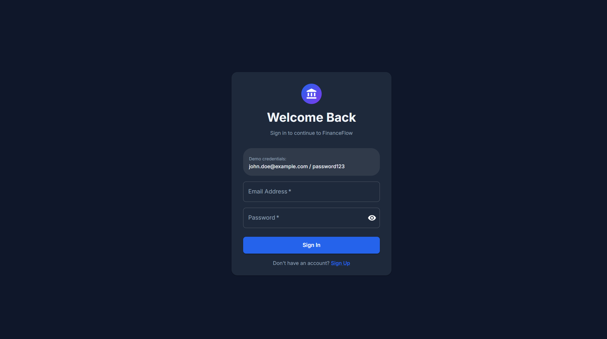
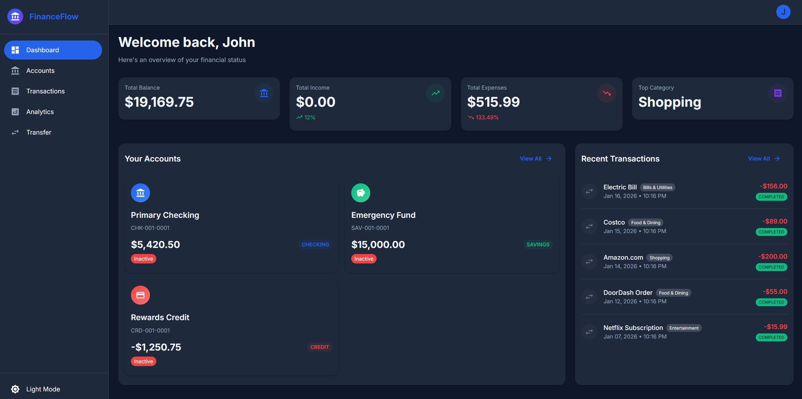
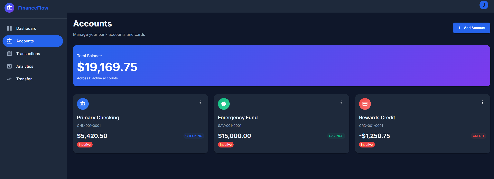
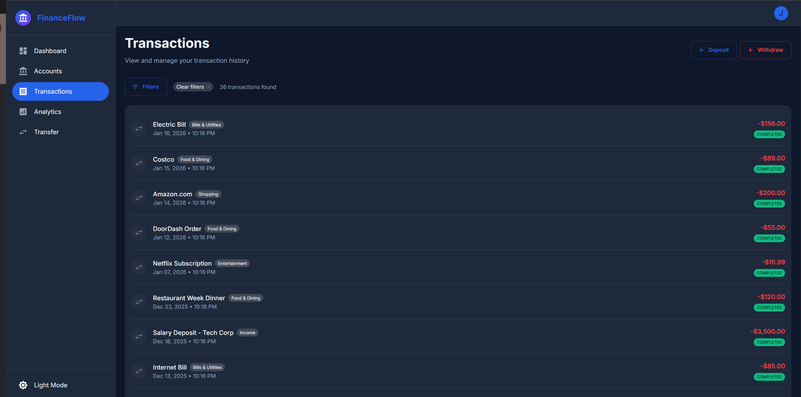
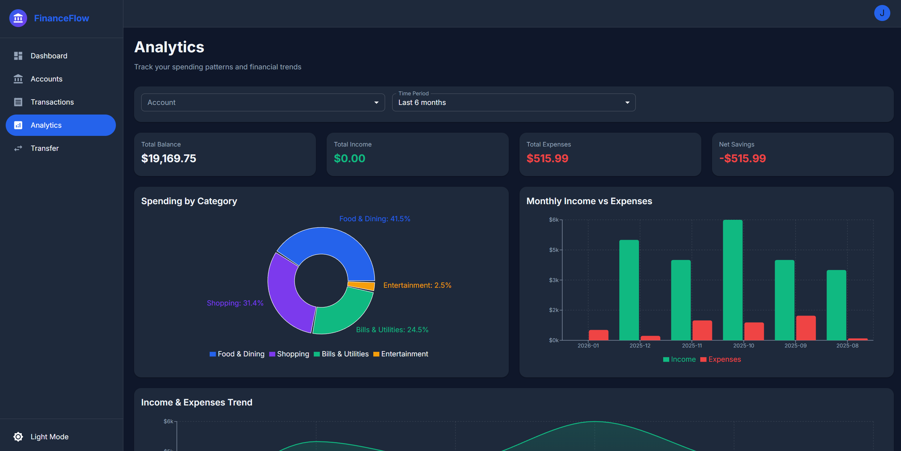

<div align="center">

# FinanceFlow

### Full-Stack Banking Platform

[](https://openjdk.org/)
[](https://spring.io/projects/spring-boot)
[](https://react.dev/)
[](https://opensource.org/licenses/MIT)

**A full-stack microservices banking platform built with Spring Boot, React, and PostgreSQL.**

[Live Demo](https://frontend-two-virid-21.vercel.app) | [Features](#features) | [Architecture](#architecture) | [Quick Start](#quick-start) | [API Reference](#api-reference) | [Tech Stack](#tech-stack)

---

</div>

## Live Demo

The application is deployed and accessible at the following URLs:

| Service | URL |
|-|-|
| **Frontend** | https://frontend-two-virid-21.vercel.app |
| **API Gateway** | https://financeflow-api-kkuw.onrender.com |
| **Auth Service** | https://financeflow-auth.onrender.com |
| **Account Service** | https://financeflow-account.onrender.com |
| **Transaction Service** | https://financeflow-transaction.onrender.com |
| **Analytics Service** | https://financeflow-analytics.onrender.com |

**Demo credentials:** `john.doe@example.com` / `password123`

> **Note:** Backend services are on Render's free tier and may take 30-60 seconds to wake up on first request.

---

## Why I Built This

I wanted to build something that goes beyond a basic CRUD app and actually deals with the kinds of problems you'd hit in a real banking system -- things like concurrent balance updates, atomic transfers, and keeping multiple services in sync.

The pessimistic locking on balance updates was something I had to debug for hours before getting right. Turns out it's easy to write a transfer endpoint that passes all your tests but breaks under concurrent load. I also underestimated how much work goes into a proper JWT auth flow with refresh token rotation -- the edge cases around token expiry and race conditions between tabs were tricky.

---

## Screenshots

| Login | Dashboard |
|-------|-----------|
|  |  |

| Accounts | Transactions |
|----------|--------------|
|  |  |

| Analytics |
|-----------|
|  |

---

## Features

<table>
<tr>
<td width="50%">

### Authentication & Security
- JWT-based stateless authentication
- Refresh token rotation for security
- BCrypt password hashing
- Protected routes & API endpoints

### Account Management
- Multiple account types (Checking, Savings, Credit)
- Real-time balance tracking
- Auto-generated account numbers
- Soft delete for data retention

</td>
<td width="50%">

### Transaction Processing
- Deposits, withdrawals, transfers
- **Pessimistic locking** prevents race conditions
- **Atomic transfers** - both succeed or both fail
- Unique reference numbers (TXN-YYYY-NNNNNN)
- Advanced filtering & pagination

### Analytics Dashboard
- Spending by category breakdown
- Monthly trend analysis
- Income vs. expenses comparison
- Interactive charts with Recharts

</td>
</tr>
</table>

---

## Architecture

```
┌─────────────────────────────────────────────────────────────────────────────┐
│                                FRONTEND                                     │
│                     React 18 + TypeScript + Material UI                     │
│                              Port: 3000                                     │
└─────────────────────────────────┬───────────────────────────────────────────┘
                                  │ HTTP/REST
                                  ▼
┌─────────────────────────────────────────────────────────────────────────────┐
│                            API GATEWAY                                      │
│                    Spring Cloud Gateway (Port: 8080)                        │
│         ┌──────────────┬──────────────┬──────────────┬──────────────┐       │
│         │   Routing    │  JWT Filter  │    CORS      │   Circuit    │       │
│         │              │              │   Config     │   Breaker    │       │
│         └──────────────┴──────────────┴──────────────┴──────────────┘       │
└────────┬──────────────┬──────────────┬──────────────┬───────────────────────┘
         │              │              │              │
         ▼              ▼              ▼              ▼
┌─────────────┐ ┌─────────────┐ ┌─────────────┐ ┌─────────────┐
│    AUTH     │ │   ACCOUNT   │ │ TRANSACTION │ │  ANALYTICS  │
│   SERVICE   │ │   SERVICE   │ │   SERVICE   │ │   SERVICE   │
│   (8081)    │ │   (8082)    │ │   (8083)    │ │   (8084)    │
├─────────────┤ ├─────────────┤ ├─────────────┤ ├─────────────┤
│ • Register  │ │ • Create    │ │ • Deposit   │ │ • Spending  │
│ • Login     │ │ • List      │ │ • Withdraw  │ │   by Cat.   │
│ • JWT Gen   │ │ • Balance   │ │ • Transfer  │ │ • Monthly   │
│ • Refresh   │ │ • Update    │ │ • History   │ │   Trends    │
└──────┬──────┘ └──────┬──────┘ └──────┬──────┘ └──────┬──────┘
       │               │               │               │
       └───────────────┴───────────────┴───────────────┘
                               │
                    ┌──────────┼──────────┐
                    ▼                     ▼
         ┌─────────────────────┐ ┌──────────────────────┐
         │     PostgreSQL      │ │       Redis           │
         │     (Port: 5432)    │ │     (Port: 6379)      │
         │                     │ │                       │
         │  • users            │ │  • Analytics cache    │
         │  • refresh_tokens   │ │  • TTL eviction       │
         │  • accounts         │ │  • LRU policy         │
         │  • transactions     │ │                       │
         └─────────────────────┘ └───────────────────────┘
```

### Key Design Patterns

| Pattern | Implementation |
|---------|----------------|
| **API Gateway** | Single entry point, JWT validation, rate limiting, circuit breakers |
| **DTO Pattern** | Separate domain models from API contracts |
| **Repository Pattern** | Abstract data access with Spring Data JPA |
| **Service Layer** | Business logic encapsulation |
| **Global Exception Handling** | Consistent error responses across services |
| **Pessimistic Locking** | `@Lock(PESSIMISTIC_WRITE)` for balance updates |
| **Atomic Transactions** | `@Transactional` for multi-account transfers |

---

## Quick Start

### Prerequisites

- **Docker Desktop** ([Download](https://www.docker.com/products/docker-desktop/)) - Make sure it's **running**
- 8GB+ free disk space
- Ports 3000, 5432, 8080-8084 available

### One-Command Setup

```bash
# Clone the repository
git clone https://github.com/PohTeyToe/FinanceFlow.git
cd FinanceFlow

# Start all services (first run takes ~5 minutes)
docker compose up --build
```

### Access the Application

| Service | URL | Description |
|---------|-----|-------------|
| **Frontend** | http://localhost:3000 | React web application |
| **API Gateway** | http://localhost:8080 | Main API entry point |

### Demo Credentials

```
Email:    john.doe@example.com
Password: password123
```

> **Windows Users:** Use `docker compose` (with space), not `docker-compose` (hyphen).

---

## API Reference

All endpoints are accessed through the **API Gateway** at `http://localhost:8080`.

### Authentication

```http
POST /api/auth/register    # Create new account
POST /api/auth/login       # Get JWT tokens
POST /api/auth/refresh     # Refresh access token
GET  /api/auth/me          # Get current user (Protected)
```

<details>
<summary><b>Example: Login Request</b></summary>

```bash
curl -X POST http://localhost:8080/api/auth/login \
  -H "Content-Type: application/json" \
  -d '{"email": "john.doe@example.com", "password": "password123"}'
```

**Response:**
```json
{
  "accessToken": "eyJhbGciOiJIUzI1NiIs...",
  "refreshToken": "eyJhbGciOiJIUzI1NiIs...",
  "expiresIn": 86400,
  "user": {
    "id": "550e8400-e29b-41d4-a716-446655440000",
    "email": "john.doe@example.com",
    "firstName": "John",
    "lastName": "Doe"
  }
}
```
</details>

### Accounts

```http
GET    /api/accounts           # List user's accounts (Protected)
GET    /api/accounts/{id}      # Get account details (Protected)
POST   /api/accounts           # Create new account (Protected)
GET    /api/accounts/{id}/balance  # Get balance (Protected)
```

### Transactions

```http
GET    /api/transactions              # List with filters (Protected)
POST   /api/transactions/deposit      # Make deposit (Protected)
POST   /api/transactions/withdraw     # Make withdrawal (Protected)
POST   /api/transactions/transfer     # Transfer funds (Protected)
```

<details>
<summary><b>Query Parameters for GET /api/transactions</b></summary>

| Parameter | Type | Description |
|-----------|------|-------------|
| `accountId` | UUID | **Required** - Account to query |
| `type` | string | Filter: DEPOSIT, WITHDRAWAL, TRANSFER_IN, TRANSFER_OUT |
| `category` | string | Filter by category |
| `startDate` | ISO date | Filter from date |
| `endDate` | ISO date | Filter to date |
| `page` | int | Page number (0-indexed) |
| `size` | int | Page size (default: 20) |

</details>

### Analytics

```http
GET /api/analytics/spending-by-category  # Spending breakdown (Protected)
GET /api/analytics/monthly-trend         # Monthly trends (Protected)
GET /api/analytics/summary               # Account summary (Protected)
GET /api/analytics/income-vs-expenses    # Income comparison (Protected)
```

---

## Tech Stack

**Backend:** Java 17, Spring Boot 3.2, Spring Security 6, Spring Cloud Gateway, Spring Data JPA, PostgreSQL 15, Redis 7, Resilience4j
**Frontend:** React 18, TypeScript 5, Vite, TanStack Query, Material UI, Recharts
**DevOps:** Docker Compose, GitHub Actions CI/CD, Terraform (AWS ECS/RDS/ALB), Kubernetes manifests

---

## Testing

```bash
cd backend && mvn test              # Run all backend tests
mvn test jacoco:report              # With coverage report
```

---

## Deployment

### Frontend (Vercel)
1. Connect the repository on [Vercel](https://vercel.com)
2. Set root directory to `frontend`
3. Set `VITE_API_URL` environment variable to your API Gateway URL
4. Deploy

### Backend (Render)
The microservices architecture requires multiple service instances. See `render.yaml` for the complete Blueprint configuration.

**Required services:** API Gateway, Auth, Account, Transaction, Analytics, PostgreSQL, Redis (7 total).

### Local Development (recommended for demos)
```bash
docker-compose up --build
# Frontend: http://localhost:3000
# API Gateway: http://localhost:8080
# Demo login: john.doe@example.com / password123
```

### Other Deployment Options
- **Kubernetes:** Manifests in `k8s/` (Deployments, Services, ConfigMap, Ingress, HPA). See [`k8s/README.md`](k8s/README.md).
- **AWS (Terraform):** ECS Fargate, RDS, ALB, VPC in `terraform/`. See [`terraform/README.md`](terraform/README.md).

---

## Local Development

<details>
<summary><b>Running without Docker</b></summary>

Requires Java 17, Maven 3.8+, Node.js 18+, and Docker (for PostgreSQL/Redis).

```bash
# Start infrastructure
docker compose up -d postgres redis

# Build and run backend (separate terminals, start auth-service first)
cd backend && mvn clean install -DskipTests
cd backend/auth-service && mvn spring-boot:run
cd backend/account-service && mvn spring-boot:run
cd backend/transaction-service && mvn spring-boot:run
cd backend/analytics-service && mvn spring-boot:run
cd backend/api-gateway && mvn spring-boot:run

# Start frontend
cd frontend && npm install && npm run dev
```

Each service reads from `application.yml` with sensible defaults. Override with env vars: `POSTGRES_HOST`, `POSTGRES_PORT`, `JWT_SECRET`, `REDIS_HOST`.

</details>

---

## Troubleshooting

<details>
<summary><b>Common issues</b></summary>

- **Windows:** Use `docker compose` (with space), not `docker-compose`
- **Port conflict:** `docker compose down` to free ports, or check with `netstat -ano | findstr :8080`
- **Service crash on boot:** Usually PostgreSQL isn't ready yet. Check `docker compose ps`, then `docker compose restart <service>`
- **Stale data:** `docker compose down -v` removes volumes, then `docker compose up --build` re-runs init-db.sql
- **Full reset:** `docker compose down -v --rmi local && docker compose up --build`

</details>

---

## What I Learned

The transfer endpoint was the hardest part -- locking both accounts, updating balances, and creating two transaction records atomically. Getting the lock ordering wrong causes deadlocks, and `@Lock(PESSIMISTIC_WRITE)` only works if you're consistent about which account you lock first.

My initial API Gateway design re-validated JWTs by calling the auth service on every request, defeating the point of stateless tokens. Refactoring to validate signatures locally in a filter was a good lesson in what "stateless" actually means.

On the DevOps side, writing Terraform modules for AWS taught me that ~80% of infrastructure config is networking and security groups, not service deployment.

---

## Known Issues

- No integration tests between services — unit tests only, so inter-service contract issues aren't caught until runtime
- Terraform state is stored locally (no S3 backend) — not suitable for team usage without remote state
- K8s manifests tested on minikube only, not validated on EKS/GKE production clusters
- Analytics queries run against the primary database — heavy reports can impact transaction throughput
- No rate limiting on the API Gateway — vulnerable to abuse without external rate limiting (e.g., AWS WAF)

## Roadmap

- [ ] Integration test suite using Testcontainers for inter-service communication
- [ ] Terraform remote state backend (S3 + DynamoDB locking)
- [ ] Read replica for analytics queries to reduce primary database load
- [ ] API rate limiting via Spring Cloud Gateway's built-in RequestRateLimiter filter
- [ ] Event sourcing for transaction history (append-only audit log)

---

## License

This project is licensed under the MIT License - see the [LICENSE](LICENSE) file for details.

